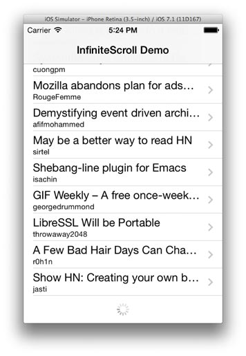

## UIScrollView+InfiniteScroll

Infinite scroll implementation as a category for UIScrollView.

<p align="center"></p>

### CocoaPods

This repo has podspec so you can use it in your Podfile. I'll take an effort to put it on CocoaPods some time later.

```ruby
pod 'UIScrollView-InfiniteScroll', :git => 'https://github.com/pronebird/UIScrollView-InfiniteScroll.git'
```

### Example

```objc
- (void)viewDidAppear:(BOOL)animated {
    [super viewDidAppear:animated];

    // setup infinite scroll
    [self.tableView addInfiniteScrollWithHandler:^(UIScrollView* scrollView) {
        //
        // fetch your data here, can be async operation,
        // just make sure to call finishInfiniteScroll in the end
        //

        // finish infinite scroll animation
        [scrollView finishInfiniteScroll];
    }];
}

- (void)viewDidDisappear:(BOOL)animated {
    [super viewDidDisappear:animated];

    // remove infinite scroll
    [self.tableView removeInfiniteScroll];
}
```
