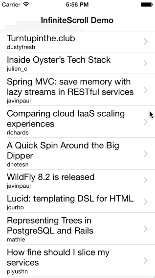

## UIScrollView+InfiniteScroll

Infinite scroll implementation as a category for UIScrollView.



### CocoaPods

Just add the following line in your Podfile:

```ruby
pod 'UIScrollView-InfiniteScroll', '~> 0.2'
```

### Example

```objc
// Somewhere in your implementation file
#import <UIScrollView+InfiniteScroll.h>

// ...

- (void)viewDidLoad {
    [super viewDidLoad];

    // setup infinite scroll
    [self.tableView addInfiniteScrollWithHandler:^(UIScrollView* scrollView) {
        //
        // fetch your data here, can be async operation,
        // just make sure to call finishInfiniteScroll in the end
        //

        // finish infinite scroll animation
        [scrollView finishInfiniteScroll];
    }];
}
```
